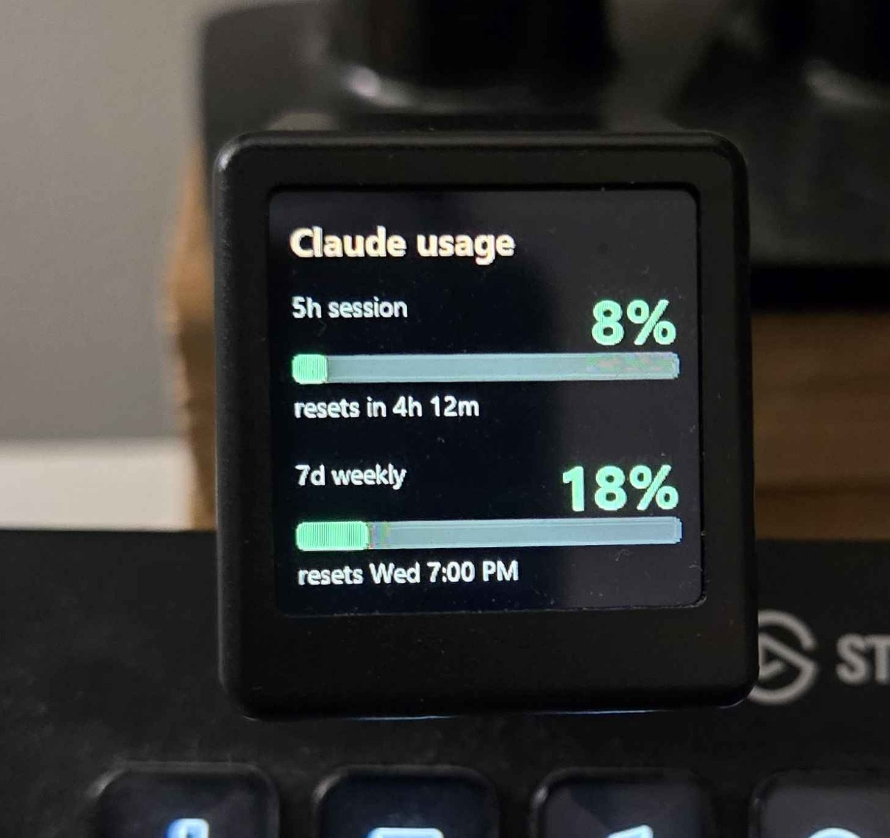
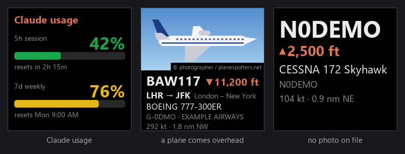

# geekmagic-customdisplay

Drive a GeekMagic **SmallTV-Ultra** (240×240) over the LAN: push rendered frames, animated
GIFs and device settings. On top of that it runs a live **Claude usage meter**, and with a local
ADS-B receiver it pops up the **aircraft flying overhead**. The device API is documented in
[docs/ultra-api.md](docs/ultra-api.md).

<p align="center"></p>

The idea comes from [claude-meter](https://github.com/shavindraSN/claude-meter) by
[@shavindraSN](https://github.com/shavindraSN).

## Setup
```powershell
python -m venv .venv
.venv\Scripts\pip install -e ".[dev]"
```
Displays are listed in `config.json` in `%LOCALAPPDATA%\clockdisplay` (`~/.config/clockdisplay`
off Windows):
```json
{
  "displays": [
    {"name": "desk",  "host": "192.168.1.50", "app": "claude"},
    {"name": "shelf", "host": "192.168.1.51", "app": "off"}
  ]
}
```
`app` says what the display runs: `claude` (the usage meter, the default), `adsb` (aircraft
overhead, see [Aircraft overhead](#aircraft-overhead-ads-b)) or `off` (leave it alone). An older
config with a single `"host"` still works and counts as one display.
Give each display a name you'll recognise. Use **Rename…** in the tray, `clock rename display desk`,
or the file itself. **Identify** in the tray shows the name and IP on that screen for a few
seconds, so you can tell which physical display is which.

The CLI targets the first display by default. Use `-d NAME` for another display, `-d all` for every
display (render commands, `restore`, `clean`), or `--host IP` / `$env:CLOCK_HOST` for an
unconfigured one. Without any config the host defaults to `192.0.2.10`.

## CLI
```powershell
clock displays                     # configured displays, their app, and whether they respond
clock rename display desk          # rename a configured display
clock info                         # model, firmware, theme, brightness, free space
clock theme                        # list themes (* = active); `clock theme 1` to switch
clock brightness 40
clock night on --start 22 --end 7 --brightness 5
clock cycle 1 4 --interval 30      # auto-rotate themes; `clock cycle --off`
clock clockstyle --colors "#ffffff" "#d97757" "#ffffff" --12h on

clock text "Hello\nClaude" --fg "#d97757"
clock color orange
clock image photo.jpg --mode contain
clock gif party.gif
clock meter 83 --label "5h session" --sub "resets in 1h 4m"
clock demo --five 42 --week 76     # mock Claude usage card (--fire: heavy-burn animation)
clock pattern                      # colour/geometry test pattern
clock anim scroll "Claude Code"    # also: anim fill 64, anim blink "!"

clock restore                      # go back to the theme active before we took over
clock files                        # list device files (* = ours)
clock clean                        # delete only our cm_* files
clock -d all demo                  # push to every configured display; -d shelf for one
```
Add `--out file.png` (or `.gif` for animations) to any render command to preview it locally
without touching the device.

## Claude usage
Live 5h-session / 7d-weekly usage (the same numbers as Claude → Settings → Usage) comes from
Anthropic's OAuth usage endpoint, authenticated with your existing **Claude Code** sign-in, so
install Claude Code and run `claude` once to sign in first.
```powershell
clock auth                         # where the token comes from and when it expires
clock usage                        # fetch once, print and push the usage card (--no-push, --out)
clock watch                        # keep the displays updated in the foreground (usage + aircraft)
```
Tokens: the credentials in `%USERPROFILE%\.claude\.credentials.json` are the source of truth.
A cached copy lives in **Windows Credential Manager** (`clockdisplay` / `claude-oauth`). When a
token expires the app refreshes it and writes the rotated pair back to Claude Code's file so
the `claude` CLI stays signed in. `clock auth --logout` clears the cached copy.

### Tray app
```powershell
.venv\Scripts\clock-tray.exe       # or: pythonw -m clockdisplay.tray
```
The icon shows the 5h % and the tooltip shows both windows with their reset times, plus how many
displays are unreachable. Usage is fetched once per poll and pushed to every `claude` display in
parallel, so one display that is offline doesn't hold up the others. The menu has Refresh now,
Pause all displays, Restore all clock themes, a submenu for each display (status, Identify, Rename…,
Pause updates, Restore clock theme, Open web UI), an **Aircraft** submenu (see
[below](#aircraft-overhead-ads-b)), Edit settings, Open data folder, **Start with Windows** (an
HKCU `Run` entry) and Quit. Displays added to or removed from `config.json` show up on the next
poll. Only one instance runs at a time.

### Portable exe
Download `ClockDisplay.exe` from the [latest release](https://github.com/rovicomm/geekmagic-customdisplay/releases/latest),
or build it yourself:
```powershell
.venv\Scripts\pip install -e ".[build]"
.venv\Scripts\python scripts\build_exe.py     # -> dist\ClockDisplay.exe (~19 MB)
```
`ClockDisplay.exe` is the tray app as a single file with no Python needed, so it can be copied
anywhere. It still uses the machine's Claude Code sign-in, Credential Manager and
`%LOCALAPPDATA%\clockdisplay`. "Start with Windows" points at wherever the exe lives, so toggle
it off and on again after moving it. One-file exes unpack to `%TEMP%` on launch (a second or two),
and SmartScreen may warn the first time ("More info" -> "Run anyway") because the exe is not
Authenticode-signed.

Release builds come from GitHub Actions with a signed build-provenance attestation, so you can
check that a download was built from this repo's source:
```powershell
gh attestation verify ClockDisplay.exe --repo rovicomm/geekmagic-customdisplay
```

### Releasing
The version lives in `src/clockdisplay/__init__.py` (`__version__`). Bump it, merge to `main`,
then push a matching tag. `.github/workflows/release.yml` tests, builds, attests and publishes
the exe as a GitHub Release:
```powershell
git tag v1.0.0 origin/main
git push origin v1.0.0
```

Files live in `%LOCALAPPDATA%\clockdisplay`: `config.json`, `state.json`, `logs\tray.log` and the
aircraft photo cache `photos\`.
`config.json` keys (re-read every poll):

| key | default | |
| --- | --- | --- |
| `displays` | one entry from `host` | list of `{name, host, app}`; see Setup |
| `host` | `192.0.2.10` | legacy single-display IP, used when `displays` is absent |
| `poll_interval` | `120` | seconds between fetches (minimum 30); faster polling triggers rate limiting |
| `force_push` | `600` | re-push unchanged numbers so the countdowns stay fresh |
| `autopush` | `true` | `false` = tray only, leave the display alone |
| `fire_rate` | `40` | 5h burn rate (%/hour) that sets the 5h line on fire; `0` turns it off |
| `fire_window` | `600` | seconds of history the burn rate is measured over |
| `reset_seconds` | `6` | seconds a celebration GIF plays when the 5h or 7d window resets; `0` turns it off |

An even pace uses up the 5h window at 20 %/h. When the rate over the last `fire_window` reaches
`fire_rate`, the card becomes a looping GIF with flames on the 5h line. It goes back to the still
card once the rate falls below half of `fire_rate`, or when the window resets. Preview it with
`clock demo --fire --out fire.gif`, or watch it on the device in
[docs/images/fire.mp4](docs/images/fire.mp4).

When a window resets, every `claude` display plays a short GIF for `reset_seconds` before the card
comes back: [yesssss.gif](docs/images/yesssss.gif) for the 5h window and
[yesssssss.gif](docs/images/yesssssss.gif) for the 7d one (both play, 7d first, if they reset at
the same time). Both are kept on the display as `cm_reset_5h.gif` and `cm_reset_7d.gif` (~760 KB
in all), uploaded once in the background when the meter starts, so a reset doesn't wait on
an upload. The device copies in `src/clockdisplay/assets/` are cropped to 240x240, with half the
frames, to fit both in the display's free space. Regenerate them with
`.venv\Scripts\python scripts\reset_gifs.py`. Preview one with `clock gif src/clockdisplay/assets/reset_5h.gif`.

## Aircraft overhead (ADS-B)
If you run an ADS-B receiver on your network (readsb, tar1090, dump1090-fa or piaware), the
displays can show the planes flying over you. When one comes within range it pops up over the
Claude usage card, then the usage card comes back:

<p align="center"></p>

<sub>Sample data. The photo is an illustration; real photos come from planespotters.net.</sub>

The card shows:
* a **photo** from [planespotters.net](https://www.planespotters.net), with the photographer
  credited as their terms require. Planes without one get the larger text-only layout on the right.
* **callsign** and **altitude**, with an arrow when the plane is climbing or descending.
* the **route**, e.g. `LHR → JFK London – New York`. It comes from the crowd-sourced routeset API
  that tar1090 uses ([adsb.im](https://adsb.im)). Only airline callsigns are looked up, and routes
  that don't match where the plane actually is are dropped.
* **type**, **registration** and **operator**, from readsb's aircraft database (blank on receivers
  without it).
* **speed**, and **distance and direction** from you.

Each of these can be switched off, and the photo shrinks to make room for whatever you keep.

### Setup
Point the app at the receiver's web address, the same one that shows its map, or use
**Aircraft → Set receiver URL…** in the tray:
```json
{
  "displays": [{"name": "desk", "host": "192.168.1.50", "app": "claude"}],
  "adsb": {"url": "http://192.168.1.20:8080"}
}
```
Distances are measured from the receiver's own position. Set `"location": [lat, lon]` if you
want them measured from somewhere else, or if your receiver doesn't publish its position.

### What pops up, and for how long
* **What counts as overhead** is anything within `radius` nautical miles (default 5) that passes your
  filters: altitude band, aircraft type, airline, ground traffic, military only.
* **What can interrupt** a `claude` display is anything within `popup_radius`. By default that's the
  same as `radius`; set it smaller so that only planes passing close by take over the screen.
* **How long** a pop-up lasts is `popup_seconds` (default 30). Set it to `0` ("Until the plane
  leaves" in the tray) to keep the card up until the plane flies back out of `popup_radius`,
  updating as it goes. If another plane is already waiting, the display moves straight on to it
  instead of briefly showing the usage card in between. A plane circling nearby lets go after
  `popup_max` seconds.
* The same plane doesn't pop up again for `cooldown` seconds (default 30 minutes). A plane that
  arrives while another is on screen gets its turn afterwards, if it's still in range.
* Set `"adsb_popup": false` on a display to keep pop-ups off it. A display with `"app": "adsb"`
  shows the nearest plane all the time instead, and goes back to its clock theme when the sky
  is empty.

### Tray
The **Aircraft** menu shows how many planes are overhead and the nearest one. From it you can:
* switch spotting and pop-ups on and off;
* set the pop-up length, the overhead radius and the pop-up radius;
* choose which fields the card shows;
* set the receiver URL, or open the receiver's map;
* pop up the nearest plane now to try out your settings.

### CLI
```powershell
clock planes                       # what's overhead now, * = would pop up (--all: everything tracked)
clock plane                        # push the nearest plane's card
clock plane BAW117 --out card.png  # a particular plane (callsign, registration or hex), saved locally
```
`clock watch` runs the spotter alongside the usage meter.

### Settings
All in the `adsb` block of `config.json`, re-read every poll:

| key | default | |
| --- | --- | --- |
| `url` | `""` | receiver base URL; nothing happens until it's set |
| `enabled` | `true` | master switch |
| `radius` | `5` | nautical miles from `location` that count as overhead |
| `location` | receiver's | `[lat, lon]` to measure from |
| `min_altitude` / `max_altitude` | `0` / `0` | feet; a `max_altitude` of `0` means no ceiling |
| `include_ground` | `false` | also show aircraft on the ground |
| `types` | `[]` | only these ICAO type-code prefixes, e.g. `["B74", "A38"]` |
| `callsigns` | `[]` | only these callsign prefixes (airlines), e.g. `["BAW", "DAL"]` |
| `military_only` | `false` | only aircraft flagged military in the receiver's database |
| `popup` | `true` | pop planes up over `claude` displays |
| `popup_radius` | `0` | nautical miles within which a plane can interrupt; `0` = same as `radius` |
| `popup_seconds` | `30` | how long a pop-up stays; `0` = until the plane leaves `popup_radius` |
| `popup_max` | `600` | longest an until-it-leaves pop-up can stay, in seconds |
| `cooldown` | `1800` | seconds before the same plane can pop up again |
| `refresh` | `20` | seconds between card updates while a plane is on screen |
| `poll_interval` | `5` | seconds between receiver polls |
| `fields` | all but `squawk` | card contents: `photo`, `callsign`, `route`, `altitude`, `type`, `registration`, `operator`, `speed`, `distance`, `squawk` |
| `route_api` | adsb.im | tar1090-style routeset endpoint the routes come from |

Photos are cached in `photos\` in the data folder. A photo is kept until there are 2000 of them
(the least recently shown go first), and a plane with no photo is looked up again after a week.
Routes are cached in memory for an hour. Regenerate the image above with
`.venv\Scripts\python scripts\readme_images.py`.

## On the PC: desktop window and Zebar bar
Two tray toggles show usage without a SmallTV.

**Desktop window** (tray → Desktop window) adds a display named `Desktop` with host `window` to
`config.json`. The tray pushes to it exactly as it does to a device, so it gets the usage card,
the fire, the reset GIFs, Identify, aircraft pop-ups and Pause. When it is handed back (Restore),
it shows a clock. Drag it to move it. Right-click it for Always on top, the size (240/360/480) and
Close. Its position and size are saved in the `window` block. The window lives in the tray app,
so `clock -d all …` skips it.

**Zebar bar** puts 5h/7d rings in the [neosoft](https://github.com/blaiyz/neosoft-zebar) Zebar
bar, between the volume control and the weather/date. The 5h ring catches fire when you're
burning fast. When a window resets, its "yesss" GIF pops up small under the bar section.
```powershell
clock zebar install      # or tray → Zebar bar → Install into Zebar; then restart Zebar
clock zebar              # status
clock zebar uninstall
```
The install copies `claude-usage.js` / `.css` into the widget pack and adds two tags to its
`index.html`. It also adds a no-cache rule for the tray's URL to the pack's `zpack.json`.
Re-run it after updating the pack. The bar reads `http://127.0.0.1:47815`, served by the tray
app. The section hides when the tray isn't running or the toggle is off.

| key | default | |
| --- | --- | --- |
| `zebar.enabled` | `false` | show the bar section (the tray toggle) |
| `zebar.port` | `47815` | localhost port for the bar; re-run `clock zebar install` after changing it |
| `zebar.popup_size` | `120` | reset pop-up size in pixels |
| `window.size` / `topmost` | `240` / `true` | desktop window size and always-on-top |

## How pushes work
Showing content switches to the Photo Album theme with autoplay off and remembers the previous
theme for `clock restore`. This state is kept per display, keyed by host, in `state.json`. Stills overwrite `/image/cm_main.jpg`, animations `/image/cm_anim.gif`.
Overwriting the on-screen file refreshes it without re-selecting it. Identical content is
skipped (`--force` to override) to save flash writes. The tool never deletes files it didn't
create.

## Library
```python
from clockdisplay import UltraDevice, Display
from clockdisplay.render import frames, anim, widgets, canvas

dev = UltraDevice("192.0.2.10")
Display(dev).show(frames.dual_meter(42, "in 2h 15m", 76, "Mon 9:00 AM"))
Display(dev).show(anim.fill(64, label="7d"))   # GIF bytes work too
```
`widgets` has `text_box`, `bar`, `ring`, `sparkline` and `paste_fit` for building custom 240×240 layouts.

## Tests
```powershell
.venv\Scripts\python -m pytest
```
